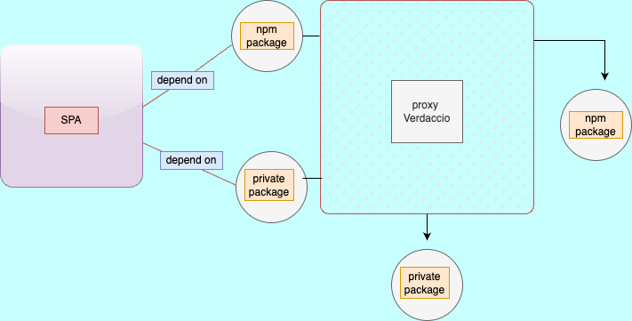
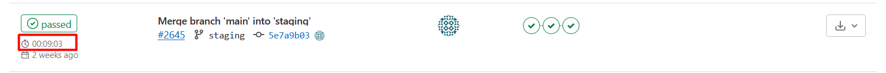
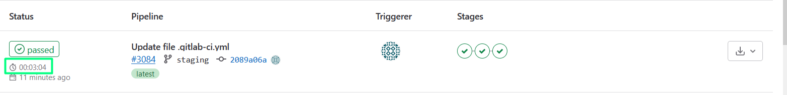

import Tabs from '@theme/Tabs';
import TabItem from '@theme/TabItem';

# How to use
The coming steps are the how to use it in your project sample (`React` project and `Angular` project)

### Let start
When we install a package in our application, we run the command npm i package_name, and by default, we download the package from the NPM registry. By setting verdaccio as an NPM proxy the flow goes like this:
- npm i package_name
- verdaccio is checking if this package belongs to its own local repository
- if it exists, we download the package from verdaccio and we never ask NPM
- if it doesn't exist, we download the package from NPM
- The following image depicts this flow:





#### First Steps
### Create Package


<Tabs>
  <TabItem value="inangular" label="Angular" default>
  To create an Angular Library we first have to create a new `Angular Application`  by running the following command.

    ```bash
    ng new my-cool-app
    ```
  </TabItem>
  <TabItem value="inreact" label="React">
  To create  React Library we first have to create a new `React Application`  by running the following command.

    ```bash
npx create-react-app my-cool-app
    ```
  </TabItem>
</Tabs>

#### Run the Application
 ```bash
  cd my-cool-app
npm start
```

### The second step is to run the command to create a library

<Tabs>
<TabItem value="angular" label="Angular" default>
```bash

ng g library my-cool-lib
```
</TabItem>
<TabItem value="react" label="React">
To create a React library using create-react-library, you can follow these steps:
```bash

npm install -g create-react-library
```

Generate the React library project by running the following command:

```bash

create-react-library my-cool-lib
```
</TabItem>
</Tabs>

As soon as the application and the library are created, we can then prepare the library for publishing. 
We have to `build` the library and the command is:

<Tabs>
<TabItem value="angular" label="Angular" default>
```bash
ng build my-cool-lib
```
</TabItem>
<TabItem value="react" label="React">

```bash
npm run build my-cool-lib
```
</TabItem>
</Tabs>

To publish a library we first have to authenticate using the command `"npm adduser"`. Since the default `registry` is the `NPM`, the generated token will refer to that. We need to add the option `--registry` to define the registry the token refers to.

```bash
npm adduser --registry http://localhost:4873/
```

​The command to publish the library is `"npm publish"`. This however will publish the library into the NPM. Since we want to `publish` it in `Verdaccio`, we will add the option `--registry` in the command.
```bash
npm publish --registry http://localhost:4873/
```

If we run `"npm i my-cool-lib"` will fail since we haven't published our package into NPM. Well, it might not fail since a package with the same name already exists there. 
To use the Verdaccio as an `NPM proxy`, we have to add in the `root directory` a file with the name `.npmrc` and configure it with the respective HTTP address.

`.npmrc`
```bash
registry=http://localhost:4873
```

### Last but not List 
### Delete registry
```bash
npm config delete registry http://localhost:4873/
```

### Summary evaluation
`Before`



`After`




